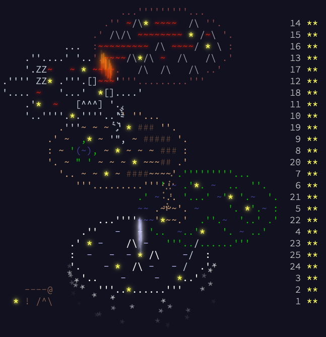
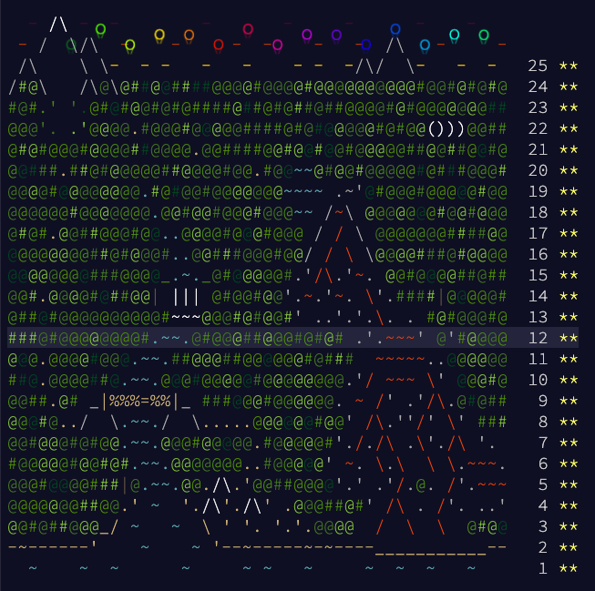
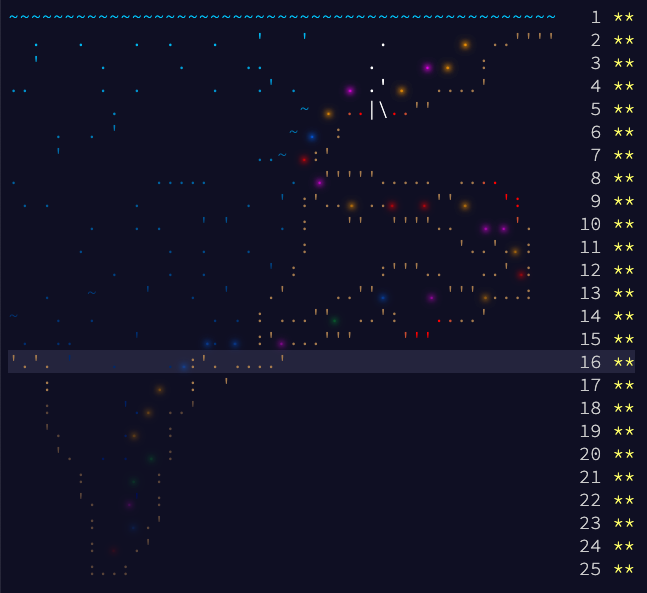
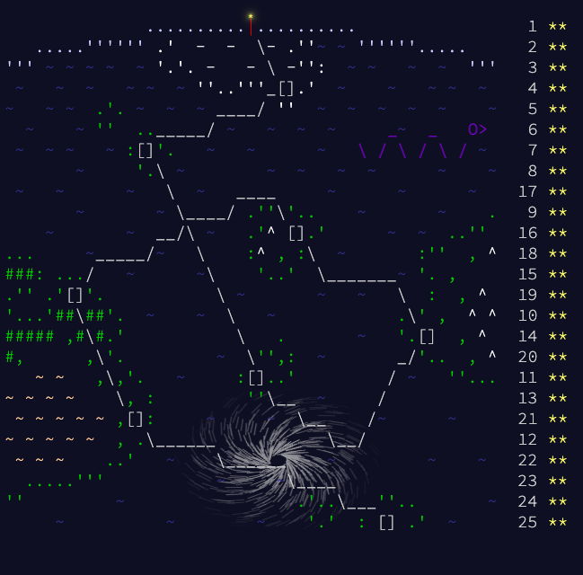

# Advent Of Code

Mostly written in Go and Rust

| Year | 01 | 02 | 03 | 04 | 05 | 06 | 07 | 08 | 09 | 10 | 11 | 12 |
|:----:|:--:|:--:|:--:|:--:|:--:|:--:|:--:|:--:|:--:|:--:|:--:|:--:|
| 2025 |  |  |  |  |  |  |  |  |  |  |  |  |

| Year | 01 | 02 | 03 | 04 | 05 | 06 | 07 | 08 | 09 | 10 | 11 | 12 |    |
|:----:|:--:|:--:|:--:|:--:|:--:|:--:|:--:|:--:|:--:|:--:|:--:|:--:|:--:|
| 2024 |  |  |  |  |  |  |  |  |  |  |  |  |
|      | **13** | **14** | **15** | **16** | **17** | **18** | **19** | **20** | **21** | **22** | **23** | **24** | **25** |
|      |  |  |  |  |  |  |  |  |  |  |  |  |  |

| Year | 01 | 02 | 03 | 04 | 05 | 06 | 07 | 08 | 09 | 10 | 11 | 12 |    |
|:----:|:--:|:--:|:--:|:--:|:--:|:--:|:--:|:--:|:--:|:--:|:--:|:--:|:--:|
| 2023 |  |  |  |  |  |  |  |  |  |  |  |  |
|      | **13** | **14** | **15** | **16** | **17** | **18** | **19** | **20** | **21** | **22** | **23** | **24** | **25** |
|      |  |  |  |  |  |  |  |  |  |  |  |  |  |

| Year | 01 | 02 | 03 | 04 | 05 | 06 | 07 | 08 | 09 | 10 | 11 | 12 |    |
|:----:|:--:|:--:|:--:|:--:|:--:|:--:|:--:|:--:|:--:|:--:|:--:|:--:|:--:|
| 2022 |  |  |  |  |  |  |  |  |  |  |  |  |
|      | **13** | **14** | **15** | **16** | **17** | **18** | **19** | **20** | **21** | **22** | **23** | **24** | **25** |
|      |  |  |  |  |  |  |  |  |  |  |  |  |  |

| Year | 01 | 02 | 03 | 04 | 05 | 06 | 07 | 08 | 09 | 10 | 11 | 12 |    |
|:----:|:--:|:--:|:--:|:--:|:--:|:--:|:--:|:--:|:--:|:--:|:--:|:--:|:--:|
| 2021 |  [:crab:](./rust/2021/day01) |  [:crab:](./rust/2021/day02) | [:crab:](./rust/2021/day03) | [:crab:](./rust/2021/day04) | [:crab:](./rust/2021/day05) |  [:crab:](./rust/2021/day06) |  [:crab:](./rust/2021/day07) | [:crab:](./rust/2021/day08) |  |  [:crab:](./rust/2021/day10) |  [:crab:](./rust/2021/day11) |  |
|      | **13** | **14** | **15** | **16** | **17** | **18** | **19** | **20** | **21** | **22** | **23** | **24** | **25** |
|      |  [:crab:](./rust/2021/day13) |  |  |  |  |  |  |  |  |  |  |  |  |

| Year | 01 | 02 | 03 | 04 | 05 | 06 | 07 | 08 | 09 | 10 | 11 | 12 |    |
|:----:|:--:|:--:|:--:|:--:|:--:|:--:|:--:|:--:|:--:|:--:|:--:|:--:|:--:|
| 2020 |  [:crab:](./rust/2020/day01) | [:crab:](./rust/2020/day02) | [:crab:](./rust/2020/day03) | [:crab:](./rust/2020/day04) | [:crab:](./rust/2020/day05) | [:crab:](./rust/2020/day06) |  |  |  |  |  | [:crab:](./rust/2020/day12) |
|      | **13** | **14** | **15** | **16** | **17** | **18** | **19** | **20** | **21** | **22** | **23** | **24** | **25** |
|      | [:crab:](./rust/2020/day13) | [:crab:](./rust/2020/day14) | [:crab:](./rust/2020/day15) | [:crab:](./rust/2020/day16) | [:crab:](./rust/2020/day17) | [:crab:](./rust/2020/day18) |  |  |  |  |  |  |  |

| Year | 01 | 02 | 03 | 04 | 05 | 06 | 07 | 08 | 09 | 10 | 11 | 12 |    |
|:----:|:--:|:--:|:--:|:--:|:--:|:--:|:--:|:--:|:--:|:--:|:--:|:--:|:--:|
| 2019 | [:crab:](./rust/2019/day01) | [:crab:](./rust/2019/day02) | [:crab:](./rust/2019/day03) | [:crab:](./rust/2019/day04) | [:crab:](./rust/2019/day05) | [:crab:](./rust/2019/day06) | [:crab:](./rust/2019/day07) | [:crab:](./rust/2019/day08) | [:crab:](./rust/2019/day09) | [:crab:](./rust/2019/day10) | [:crab:](./rust/2019/day11) | [:crab:](./rust/2019/day12) |
|      | **13** | **14** | **15** | **16** | **17** | **18** | **19** | **20** | **21** | **22** | **23** | **24** | **25** |
|      | [:crab:](./rust/2019/day13) | [:crab:](./rust/2019/day14) | [:crab:](./rust/2019/day15) | [:crab:](./rust/2019/day16) | [:crab:](./rust/2019/day17) | [:crab:](./rust/2019/day18) | [:crab:](./rust/2019/day19) | [:crab:](./rust/2019/day20) | [:crab:](./rust/2019/day21) | [:crab:](./rust/2019/day22) | [:crab:](./rust/2019/day23) | [:crab:](./rust/2019/day24) | [:crab:](./rust/2019/day25) |

| Year | 01 | 02 | 03 | 04 | 05 | 06 | 07 | 08 | 09 | 10 | 11 | 12 |    |
|:----:|:--:|:--:|:--:|:--:|:--:|:--:|:--:|:--:|:--:|:--:|:--:|:--:|:--:|
| 2018 |  |  |  |  |  |  |  |  |  |  |  |  |
|      | **13** | **14** | **15** | **16** | **17** | **18** | **19** | **20** | **21** | **22** | **23** | **24** | **25** |
|      |  |  |  |  |  |  |  |  |  |  |  |  |  |

| Year | 01 | 02 | 03 | 04 | 05 | 06 | 07 |
|:----:|:--:|:--:|:--:|:--:|:--:|:--:|:--:|
| 2017 |  |  |  |  |  |  |  |

|        | 2015 | 2016 | 2017 | 2018 | 2019 |                                               2020                                               | 2021 | 2022 | 2023 |            2024             |
|------  |:----:|:----:|:----:|:----:|:----:|:------------------------------------------------------------------------------------------------:|:----:|:----:|:----:|:---------------------------:|
| **01** | | |  |  | [:crab:](./rust/2019/day01) |  [:crab:](./rust/2020/day01) |  [:crab:](./rust/2021/day01) |  |  |  |
| **02** | | |  |  | [:crab:](./rust/2019/day02) |                                      [:crab:](./rust/2020/day02)                                 |  [:crab:](./rust/2021/day02) |  |  |  |
| **03** | | |  |  | [:crab:](./rust/2019/day03) |                                   [:crab:](./rust/2020/day03)                                    |                             [:crab:](./rust/2021/day03) |  |  |  |
| **04** | | |  |  | [:crab:](./rust/2019/day04) |                                   [:crab:](./rust/2020/day04)                                    |                             [:crab:](./rust/2021/day04) |  |  |  |
| **05** | | |  |  | [:crab:](./rust/2019/day05) |                                   [:crab:](./rust/2020/day05)                                    |                             [:crab:](./rust/2021/day05) |  |  |  |
| **06** | | |  |  | [:crab:](./rust/2019/day06) |                                   [:crab:](./rust/2020/day06)                                    |  [:crab:](./rust/2021/day06) |  |  |  |
| **07** | | |  |  | [:crab:](./rust/2019/day07) |                              |  [:crab:](./rust/2021/day07) |  |  |  |
| **08** | | | |  | [:crab:](./rust/2019/day08) |                              |                             [:crab:](./rust/2021/day08) |  |  |  |
| **09** | | | |  | [:crab:](./rust/2019/day09) |                              |                              |  |  |  |
| **10** | | | |  | [:crab:](./rust/2019/day10) |                              |  [:crab:](./rust/2021/day10) |  |  |  |
| **11** | | | |  | [:crab:](./rust/2019/day11) |                              |  [:crab:](./rust/2021/day11) |  |  |  |
| **12** | | | |  | [:crab:](./rust/2019/day12) |                                   [:crab:](./rust/2020/day12)                                    |                            |  |  |  | 
| **13** | | | |  | [:crab:](./rust/2019/day13) |                                   [:crab:](./rust/2020/day13)                                    |  [:crab:](./rust/2021/day13) |  |  |  | 
| **14** | | | |  | [:crab:](./rust/2019/day14) |                                   [:crab:](./rust/2020/day14)                                    |                              |  |  |  |
| **15** | | | |  | [:crab:](./rust/2019/day15) |                                   [:crab:](./rust/2020/day15)                                    |                              |  |  |  |
| **16** | | | |  | [:crab:](./rust/2019/day16) |                                   [:crab:](./rust/2020/day16)                                    |                              |  |  |  |
| **17** | | | |  | [:crab:](./rust/2019/day17) |                                   [:crab:](./rust/2020/day17)                                    |                              |  |  |  |
| **18** | | | |  | [:crab:](./rust/2019/day18) |                                   [:crab:](./rust/2020/day18)                                    |                              |  |  |  |
| **19** | | | |  | [:crab:](./rust/2019/day19) |                              |                              |  |  |  |
| **20** | | | |  | [:crab:](./rust/2019/day20) |                              |                              |  |  |  |
| **21** | | | |  | [:crab:](./rust/2019/day21) |                              |                              |  |  |  |
| **22** | | | |  | [:crab:](./rust/2019/day22) |                              |                              |  |  |  |
| **23** | | | |  | [:crab:](./rust/2019/day23) |                              |                              |  |  |  |
| **24** | | | |  | [:crab:](./rust/2019/day24) |                              |                              |  |  |  |
| **25** | | | |  | [:crab:](./rust/2019/day25) |                              |                              |  |  |  |

# Commands

## Go

- `cd go/<n>` and `go run .`
- `go test` to run unit tests
- `go test -bench .` to run benchmarks
- `go test ./...` to run unit tests in all subdirectories

## Rust

- `cd rust/<n>` and `cargo run`
- `cargo run --release` to run the puzzle in release mode
- `cargo test` to run unit tests
- `cargo bench` to run benchmarks

# [Year 2025](README-2025.md)

Execution time on an MacBook Air M2

| Go                              | part A      | part B      |
|---------------------------------|-------------|-------------|
| [day 01](./go/2025/01/day01.go) | ` 0.105 ms` | ` 0.118 ms` |
| [day 02](./go/2025/02/day02.go) | ` 4.277 ms` | ` 15.21 ms` |
| [day 03](./go/2025/03/day03.go) |             |             |
| [day 04](./go/2025/04/day04.go) |             |             |
| [day 05](./go/2025/05/day05.go) |             |             |
| [day 06](./go/2025/06/day06.go) |             |             |
| [day 07](./go/2025/07/day07.go) |             |             |
| [day 08](./go/2025/08/day08.go) |             |             |
| [day 09](./go/2025/09/day09.go) |             |             |
| [day 10](./go/2025/10/day10.go) |             |             |
| [day 11](./go/2025/11/day11.go) |             |             |
| [day 12](./go/2025/12/day12.go) |             |             |
| **Sum**                        | ` 0.004 s`   | ` 0.015 s`   |

# [Year 2024](README-2024.md)

Execution time on an MacBook Air M2

| Go                              | part A      | part B      |
|---------------------------------|-------------|-------------|
| [day 01](./go/2024/01/day01.go) | ` 0.052 ms` | ` 0.074 ms` |
| [day 02](./go/2024/02/day02.go) | ` 1.676 ms` | ` 1.946 ms` |
| [day 03](./go/2024/03/day03.go) | ` 0.037 ms` | ` 0.062 ms` |
| [day 04](./go/2024/04/day04.go) | ` 2.976 ms` | ` 3.370 ms` |
| [day 05](./go/2024/05/day05.go) | ` 0.192 ms` | ` 0.457 ms` |
| [day 06](./go/2024/06/day06.go) | ` 0.712 ms` | ` 405.7 ms` |
| [day 07](./go/2024/07/day07.go) | ` 0.300 ms` | ` 0.443 ms` |
| [day 08](./go/2024/08/day08.go) | ` 0.027 ms` | ` 0.095 ms` |
| [day 09](./go/2024/09/day09.go) | ` 0.943 ms` | ` 0.752 ms` |
| [day 10](./go/2024/10/day10.go) | ` 0.240 ms` | ` 0.240 ms` |
| [day 11](./go/2024/11/day11.go) | ` 0.230 ms` | ` 12.38 ms` |
| [day 12](./go/2024/12/day12.go) | ` 10.15 ms` | ` 19.84 ms` |
| [day 13](./go/2024/13/day13.go) | ` 0.722 ms` | ` 0.730 ms` |
| [day 14](./go/2024/14/day14.go) | ` 0.380 ms` | ` 85.94 ms` |
| [day 15](./go/2024/15/day15.go) | ` 4.978 ms` | ` 5.852 ms` |
| [day 16](./go/2024/16/day16.go) | ` 11.89 ms` | ` 52.57 ms` |
| [day 17](./go/2024/17/day17.go) | ` 0.002 ms` | ` 0.119 ms` |
| [day 18](./go/2024/18/day18.go) | ` 3.392 ms` | ` 3.399 ms` |
| [day 19](./go/2024/19/day19.go) | ` 17.81 ms` | ` 17.98 ms` |
| [day 20](./go/2024/20/day20.go) | ` 32.25 ms` | ` 33.66 ms` |
| [day 21](./go/2024/21/day21.go) | ` 0.034 ms` | ` 0.158 ms` |
| [day 22](./go/2024/22/day22.go) | ` 21.20 ms` | ` 374.5 ms` |
| [day 23](./go/2024/23/day23.go) | ` 2.933 ms` | ` 200.6 ms` |
| [day 24](./go/2024/24/day24.go) | ` 0.412 ms` | ` 1.226 ms` |
| [day 24](./go/2024/25/day25.go) | ` 0.324 ms` |             |
| **Sum**                        | ` 0.114 s`  | ` 1.222 s`  |

# [Year 2023](README-2023.md)

## Comments: [Here](README-2023.md)

Execution time on an MacBook Air M2

| Go                              | part A      | part B      |
|---------------------------------|-------------|-------------|
| [day 01](./go/2023/01/day01.go) | ` 0.056 ms` | ` 0.045 ms` |
| [day 02](./go/2023/02/day02.go) | ` 0.096 ms` | ` 0.096 ms` |
| [day 03](./go/2023/03/day03.go) | ` 1.800 ms` | ` 2.200 ms` |
| [day 04](./go/2023/04/day04.go) | ` 0.169 ms` | ` 0.173 ms` |
| [day 05](./go/2023/05/day05.go) | ` 0.214 ms` | ` 0.253 ms` |
| [day 06](./go/2023/06/day06.go) | ` 0.000 ms` | ` 25.10 ms` |
| [day 07](./go/2023/07/day07.go) | ` 0.539 ms` | ` 0.531 ms` |
| [day 08](./go/2023/08/day08.go) | ` 0.288 ms` | ` 1.700 ms` |
| [day 09](./go/2023/09/day09.go) | ` 0.172 ms` | ` 0.172 ms` |
| [day 10](./go/2023/10/day10.go) | ` 0.924 ms` | ` 1.400 ms` |
| [day 11](./go/2023/11/day11.go) | ` 0.136 ms` | ` 0.136 ms` |
| [day 12](./go/2023/12/day12.go) | ` 16.90 ms` | ` 30.60 ms` |
| [day 13](./go/2023/13/day13.go) | ` 0.144 ms` | ` 1.210 ms` |
| [day 14](./go/2023/14/day14.go) | ` 0.049 ms` | ` 44.00 ms` |
| [day 15](./go/2023/15/day15.go) | ` 0.076 ms` | ` 0.158 ms` |
| [day 16](./go/2023/16/day16.go) | ` 1.250 ms` | ` 353.0 ms` |
| [day 17](./go/2023/17/day17.go) | ` 8.100 ms` | ` 181.0 ms` |
| [day 18](./go/2023/18/day18.go) | ` 0.017 ms` | ` 0.018 ms` |
| [day 19](./go/2023/19/day19.go) | ` 0.280 ms` | ` 0.657 ms` |
| [day 20](./go/2023/20/day20.go) | ` 2.500 ms` | ` 10.30 ms` |
| [day 21](./go/2023/21/day21.go) | ` 8200  ms` | ` 2480  ms` |
| [day 22](./go/2023/22/day22.go) | ` 6700  ms` | ` 6.700 ms` |
| [day 23](./go/2023/23/day23.go) | ` 4.100 ms` | ` 1120  ms` |
| [day 24](./go/2023/24/day24.go) | ` 2.500 ms` | ` 37.00 ms` |
| [day 25](./go/2023/25/day25.go) | graphviz    |             |
| **Sum**                        | ` 14.940 s` | ` 4.296 s`  |

# [Year 2022](README-2022.md)

## Comments: [Here](README-2022.md)

Execution time on an MacBook Air M2

| Go                              | part A         | part B      |
|---------------------------------|----------------|-------------|
| [day 01](./go/2022/01/day01.go) | ` 0.092 ms`    | ` 0.098 ms` |
| [day 02](./go/2022/02/day02.go) | ` 0.038 ms`    | ` 0.038 ms` |
| [day 03](./go/2022/03/day03.go) | ` 0.009 ms`    | ` 0.013 ms` |
| [day 04](./go/2022/04/day04.go) | ` 0.127 ms`    | ` 0.122 ms` |
| [day 05](./go/2022/05/day05.go) | ` 0.024 ms`    | ` 0.022 ms` |
| [day 06](./go/2022/06/day06.go) | ` 0.002 ms`    | ` 0.014 ms` |
| [day 07](./go/2022/07/day07.go) | ` 0.228 ms`    | ` 0.238 ms` |
| [day 08](./go/2022/08/day08.go) | ` 0.156 ms`    | ` 0.236 ms` |
| [day 09](./go/2022/09/day09.go) | ` 1.075 ms`    | ` 1.151 ms` |
| [day 10](./go/2022/10/day10.go) | ` 0.033 ms`    | ` 0.039 ms` |
| [day 11](./go/2022/11/day11.go) | ` 0.007 ms`    | ` 3.742 ms` |
| [day 12](./go/2022/12/day12.go) | ` 3.200 ms`    | ` 3.490 ms` |
| [day 13](./go/2022/13/day13.go) | ` 0.428 ms`    | ` 0.543 ms` |
| [day 14](./go/2022/14/day14.go) | ` 1.295 ms`    | ` 50.13 ms` |
| [day 15](./go/2022/15/day15.go) | ` 0.057 ms`    | ` 195.0 ms` |
| [day 16](./go/2022/16/day16.go) | ` 161.7 ms`    | ` 786.8 ms` |
| [day 17](./go/2022/17/day17.go) | ` 7.463 ms`    | ` 931.7 ms` |
| [day 18](./go/2022/18/day18.go) | ` 1.436 ms`    | ` 6.030 ms` |
| [day 19](./go/2022/19/day19.go) | ` 66.49 ms`    | ` 11.19 ms` |
| [day 20](./go/2022/20/day20.go) | ` 57.38 ms`    | ` 738.6 ms` |
| [day 21](./go/2022/21/day21.go) | ` 0.517 ms`    | ` 0.794 ms` |
| [day 22](./go/2022/22/day22.go) | ` 2.065 ms`    | ` 1.681 ms` |
| [day 23](./go/2022/23/day23.go) | ` 13.67 ms`    | ` 1024  ms` |
| [day 24](./go/2022/24/day24.go) | ` 21.77 ms`    | ` 88.03 ms` |
| [day 25](./go/2022/25/day25.go) | ` 0.029 ms`    |             |
| **Sum**                        | ` 0.339 s`     | ` 3.844 s`  |

# [Year 2021](README-2021.md)

## Comments: [Here](README-2021.md)

Execution time on an old Mac Pro (Late 2013), 3,7 GHz Quad-Core Intel Xeon E5

| Rust                        | part A      | part B      | Go                                         | part A      | part B      |
|:----------------------------|:------------|:------------|--------------------------------------------|-------------|-------------|
| [day 01](./rust/2021/day01) | ` 0.089 ms` | ` 0.067 ms` | [day 01](./go/2021/01/day01.go)            | ` 0.047 ms` | ` 0.048 ms` |
| [day 02](./rust/2021/day02) | ` 0.092 ms` | ` 0.063 ms` | [day 02](./go/2021/02/day02.go)            | ` 0.102 ms` | ` 0.103 ms` |
| [day 03](./rust/2021/day03) | ` 0.157 ms` | ` 0.084 ms` |                                            |             |             |
| [day 04](./rust/2021/day04) | ` 1.048 ms` | ` 0.841 ms` |                                            |             |             |
| [day 05](./rust/2021/day05) | ` 45.94 ms` | ` 46.03 ms` |                                            |             |             |
| [day 06](./rust/2021/day06) | ` 0.010 ms` | ` 0.008 ms` | [day 06](./go/2021/06/day06.go)            | ` 0.007 ms` | ` 0.008 ms` |
| [day 07](./rust/2021/day07) | ` 0.274 ms` | ` 0.795 ms` | [day 07](./go/2021/07/day07.go)            | ` 1.711 ms` | ` 2.841 ms` |
| [day 08](./rust/2021/day08) | ` 0.198 ms` | ` 1.786 ms` |                                            |             |             |
|                             |             |             | [day 09](./go/2021/09_simplified/day09.go) | ` 0.146 ms` | ` 0.670 ms` |
| [day 10](./rust/2021/day10) | ` 0.137 ms` | ` 0.134 ms` | [day 10](./go/2021/10/day10.go)            | ` 0.158 ms` | ` 0.160 ms` |
| [day 11](./rust/2021/day11) | ` 0.186 ms` | ` 0.420 ms` | [day 11](./go/2021/11/day11.go)            | ` 0.152 ms` | ` 0.432 ms` |
|                             |             |             | [day 12](./go/2021/12/day12.go)            | ` 0.161 ms` | ` 3.944 ms` |
| [day 13](./rust/2021/day13) | ` 0.156 ms` | ` 0.118 ms` | [day 13](./go/2021/13/day13.go)            | ` 0.441 ms` | ` 0.706 ms` |
|                             |             |             | [day 14](./go/2021/14/day14.go)            | ` 0.023 ms` | ` 0.052 ms` |
|                             |             |             | [day 15](./go/2021/15/day15.go)            | ` 9.858 ms` | ` 342.6 ms` |
|                             |             |             | [day 16](./go/2021/16/day16.go)            | ` 0.052 ms` | ` 0.049 ms` |
|                             |             |             | [day 17](./go/2021/17/day17.go)            | ` 0.133 ms` | ` 0.424 ms` |
|                             |             |             | [day 18](./go/2021/18/day18.go)            | ` 1.685 ms` | ` 25.18 ms` |
|                             |             |             | [day 19](./go/2021/19/day19.go)            | ` 20.20 ms` | ` 20.88 ms` |
|                             |             |             | [day 20](./go/2021/20/day20.go)            | ` 9.035 ms` | ` 491.5 ms` |
|                             |             |             | [day 21](./go/2021/21/day21.go)            | ` 0.002 ms` | ` 137.1 ms` |
|                             |             |             | [day 22](./go/2021/22/day22.go)            | ` 2.237 ms` | ` 56.16 ms` |
|                             |             |             | [day 23](./go/2021/23/day23.go)            | ` 7.806 ms` | ` 76.21 ms` |
|                             |             |             | [day 24](./go/2021/24/day24.go)            | ` 660.4 ms` | ` 0.003 ms` |
|                             |             |             | [day 25](./go/2021/25/day25.go)            | ` 98.00 ms` | ` 0.003 ms` |
| **Sum**                     | ` 0.048 s`  | ` 0.050 s`  |                                            | ` 0.812 s`  | ` 1.159 s`  |

# [Year 2020](README-2020.md)

## Comments: [Here](README-2020.md)

Execution time on an old Mac Pro (Late 2013), 3,7 GHz Quad-Core Intel Xeon E5

| Rust                        | part A      | part B      | Go                              | part A       | part B      |
|:----------------------------|:------------|:------------|---------------------------------|--------------|-------------|
| [day 01](./rust/2020/day01) | ` 0.034 ms` | ` 9.541 ms` | [day 01](./go/2020/01/day01.go) | ` 0.049 ms`  | ` 5.399 ms` |
| [day 02](./rust/2020/day02) | ` 0.331 ms` | ` 0.266 ms` |                                 |              |             |
| [day 03](./rust/2020/day03) | ` 0.199 ms` | ` 1.040 ms` |                                 |              |             |
| [day 04](./rust/2020/day04) | ` 0.712 ms` | ` 0.750 ms` |                                 |              |             |
| [day 05](./rust/2020/day05) | ` 0.036 ms` | ` 0.036 ms` |                                 |              |             |
| [day 06](./rust/2020/day06) | ` 0.114 ms` | ` 0.100 ms` |                                 |              |             |
|                             |             |             | [day 07](./go/2020/07/day07.go) | ` 6.542 ms`  | ` 0.934 ms` |
|                             |             |             | [day 08](./go/2020/08/day08.go) | ` 0.188 ms`  | ` 2.751 ms` |
|                             |             |             | [day 09](./go/2020/09/day09.go) | ` 0.087 ms`  | ` 0.279 ms` |
|                             |             |             | [day 10](./go/2020/10/day10.go) | ` 0.027 ms`  | ` 0.016 ms` |
| [day 11](./rust/2020/day11) | ` 22.47 ms` | ` 52.57 ms` |                                 |              |             |
| [day 12](./rust/2020/day12) | ` 0.102 ms` | ` 0.093 ms` |                                 |              |             |
| [day 13](./rust/2020/day13) | ` 0.016 ms` | ` 0.007 ms` |                                 |              |             |
| [day 14](./rust/2020/day14) | ` 0.340 ms` | ` 51.97 ms` |                                 |              |             |
| [day 15](./rust/2020/day15) | ` 0.096 ms` | ` 1798. ms` |                                 |              |             |
| [day 16](./rust/2020/day16) | ` 0.464 ms` | ` 0.706 ms` |                                 |              |             |
| [day 17](./rust/2020/day17) | ` 17.52 ms` | ` 768.0 ms` |                                 |              |             |
| [day 18](./rust/2020/day18) | ` 4.187 ms` | ` 4.134 ms` |                                 |              |             |
|                             |             |             | [day 19](./go/2020/19/day19.go) | ` 4.766 ms`  | ` 9.456 ms` |
|                             |             |             | [day 20](./go/2020/20/day20.go) | ` 36.66 ms`  | ` 44.65 ms` |
|                             |             |             | [day 21](./go/2020/21/day21.go) | ` 0.802 ms`  | ` 0.718 ms` |
|                             |             |             | [day 22](./go/2020/22/day22.go) | ` 0.008 ms`  | ` 173.1 ms` |
|                             |             |             | [day 23](./go/2020/23/day23.go) | ` 0.003 ms`  | ` 1986  ms` |
|                             |             |             | [day 24](./go/2020/24/day24.go) | ` 1.120 ms`  | ` 164.1 ms` |
|                             |             |             | [day 25](./go/2020/25/day25.go) | ` 164.4 ms`  |             |
| **Sum**                        | ` 0.047 s`   | ` 2.687 s`  |                                 | ` 0.215 s`  | ` 2.387 s`  |

# Year 2019
| Rust                              | part A      | part B      |
|---------------------------------|-------------|-------------|
| [day 01](./rust/2019/day01)  |||
| [day 02](./rust/2019/day02) |||
| [day 03](./rust/2019/day03) |||
| [day 04](./rust/2019/day04) |||
| [day 05](./rust/2019/day05) |||
| [day 06](./rust/2019/day06) |||
| [day 07](./rust/2019/day07) |||
| [day 08](./rust/2019/day08) |||
| [day 09](./rust/2019/day09) |||
| [day 10](./rust/2019/day10) |||
| [day 11](./rust/2019/day11) |||
| [day 12](./rust/2019/day12) |||
| [day 13](./rust/2019/day13) |||
| [day 14](./rust/2019/day14) |||
| [day 15](./rust/2019/day15) |||
| [day 16](./rust/2019/day16) |||
| [day 17](./rust/2019/day17) |||
| [day 18](./rust/2019/day18) |||
| [day 19](./rust/2019/day19) |||
| [day 20](./rust/2019/day20) |||
| [day 21](./rust/2019/day21) |||
| [day 22](./rust/2019/day22) |||
| [day 23](./rust/2019/day23) |||
| [day 24](./rust/2019/day24) |||
| [day 25](./rust/2019/day25) |||
| **Sum**                         |             |             |

# Year 2018

Execution time on an MacBook Air M2

| Go                              | part A         | part B         |
|---------------------------------|----------------|----------------|
| [day 01](./go/2018/01/day01.go) | ` 0.026 ms`    | ` 9.062 ms`    |
| [day 02](./go/2018/02/day02.go) | ` 0.577 ms`    | ` 0.583 ms`    |
| [day 03](./go/2018/03/day03.go) | ` 8.513 ms`    | ` 5.605 ms`    |
| [day 04](./go/2018/04/day04.go) | ` 2.180 ms`    | ` 2.202 ms`    |
| [day 05](./go/2018/05/day05.go) | ` 0.282 ms`    | ` 7.335 ms`    |
| [day 06](./go/2018/06/day06.go) | ` 9.055 ms`    | ` 5.266 ms`    |
| [day 07](./go/2018/07/day07.go) | ` 0.209 ms`    | ` 0.413 ms`    |
| [day 08](./go/2018/08/day08.go) | ` 0.371 ms`    | ` 0.367 ms`    |
| [day 09](./go/2018/09/day09.go) | ` 3.322 ms`    | ` 428.208 ms`  |
| [day 10](./go/2018/10/day10.go) | ` 400.361 ms`  | ` 337.374 ms`  |
| [day 11](./go/2018/11/day11.go) | ` 3.020 ms`    | ` 25.925 ms`   |
| [day 12](./go/2018/12/day12.go) | ` 0.184 ms`    | ` 16.645 ms`   |
| [day 13](./go/2018/13/day13.go) | ` 2.289 ms`    | ` 6.501 ms`    |
| [day 14](./go/2018/14/day14.go) | ` 7.782 ms`    | ` 309.028 ms`  |
| [day 15](./go/2018/15/day15.go) | ` 36.768 ms`   | ` 210.730 ms`  |
| [day 16](./go/2018/16/day16.go) | ` 1.876 ms`    | ` 0.604 ms`    |
| [day 17](./go/2018/17/day17.go) | ` 12.117 ms`   | ` 12.358 ms`   |
| [day 18](./go/2018/18/day18.go) | ` 1.465 ms`    | ` 126.286 ms`  |
| [day 19](./go/2018/19/day19.go) | ` 97.107 ms`   |                |
| [day 20](./go/2018/20/day20.go) | ` 24220.131 ms`| ` 24979.661 ms`|
| [day 21](./go/2018/21/day21.go) | ` 0.057 ms`    | ` 32968.482 ms`|
| [day 22](./go/2018/22/day22.go) | ` 0.176 ms`    | ` 293.027 ms`  |
| [day 23](./go/2018/23/day23.go) | ` 2.211 ms`    | ` 99547.380 ms`|
| [day 24](./go/2018/24/day24.go) | ` 19.997 ms`   | ` 1310.438 ms` |
| [day 25](./go/2018/25/day25.go) | ` 7.822 ms`    |                |
| **Sum**                         | ` 24.838 s`    | ` 160.603 s`   |

# Year 2017

Execution time on an MacBook Air M2

| Go                              | part A        | part B        |
|---------------------------------|---------------|---------------|
| [day 01](./go/2017/01/day01.go) | ` 0.003 ms`   | ` 0.003 ms`   |
| [day 02](./go/2017/02/day02.go) | ` 0.008 ms`   | ` 0.010 ms`   |
| [day 03](./go/2017/03/day03.go) | ` 0.352 ms`   | ` 0.013 ms`   |
| [day 04](./go/2017/04/day04.go) | ` 0.141 ms`   | ` 0.624 ms`   |
| [day 05](./go/2017/05/day05.go) | ` 0.959 ms`   | ` 99.689 ms`  |
| [day 06](./go/2017/06/day06.go) | ` 6.401 ms`   | ` 6.346 ms`   |
| [day 07](./go/2017/07/day07.go) | ` 0.189 ms`   | ` 0.000001 ms`|
| **Sum**                         | ` 0.008 s`    | ` 0.107 s`    |
