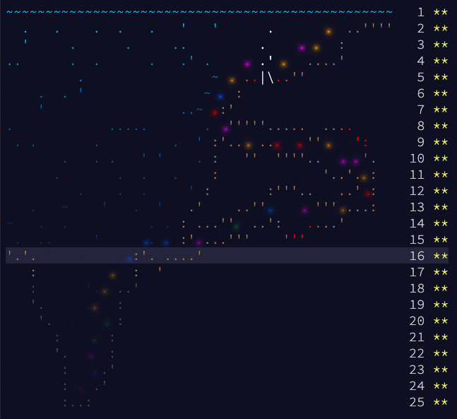

# Advent Of Code

Mostly written in Rust and Go

# Commands

## Rust

- `cd rust/<n>` and `cargo run`
- `cargo run --release` to run the puzzle in release mode
- `cargo test` to run unit tests
- `cargo bench` to run benchmarks

## Go

- `cd go/<n>` and `go run .`
- `go test` to run unit tests
- `go test -bench .` to run benchmarks

# [Year 2022](README-2022.md)

| Go                              | part A      | part B      |
|---------------------------------|-------------|-------------|
| [day 01](./go/2022/01/day01.go) | ` 0.092 ms` | ` 0.098 ms` |
| [day 02](./go/2022/02/day02.go) | ` 0.038 ms` | ` 0.038 ms` |
| [day 03](./go/2022/03/day03.go) | ` 0.009 ms` | ` 0.013 ms` |
| [day 04](./go/2022/04/day04.go) | ` 0.127 ms` | ` 0.122 ms` |
| [day 05](./go/2022/05/day05.go) | ` 0.024 ms` | ` 0.022 ms` |
| [day 06](./go/2022/06/day06.go) | ` 0.002 ms` | ` 0.014 ms` |
| [day 07](./go/2022/07/day07.go) | ` 0.228 ms` | ` 0.238 ms` |
| [day 08](./go/2022/08/day08.go) | ` 0.156 ms` | ` 0.236 ms` |
| [day 09](./go/2022/09/day09.go) | ` 1.075 ms` | ` 1.151 ms` |
| [day 10](./go/2022/10/day10.go) | ` 0.033 ms` | ` 0.039 ms` |
| [day 11](./go/2022/11/day11.go) | ` 0.007 ms` | ` 3.742 ms` |
| [day 12](./go/2022/12/day12.go) | ` 3.200 ms` | ` 3.490 ms` |
| [day 13](./go/2022/13/day13.go) | ` 0.428 ms` | ` 0.543 ms` |
| [day 14](./go/2022/14/day14.go) | ` 1.295 ms` | ` 50.13 ms` |
| [day 15](./go/2022/15/day15.go) | ` 0.000 ms` | ` 0.000 ms` |
| [day 16](./go/2022/16/day16.go) | ` 0.000 ms` | ` 0.000 ms` |
| [day 17](./go/2022/17/day17.go) | ` 0.000 ms` | ` 0.000 ms` |
| [day 18](./go/2022/18/day18.go) | ` 0.000 ms` | ` 0.000 ms` |
| [day 19](./go/2022/19/day19.go) | ` 0.000 ms` | ` 0.000 ms` |
| [day 20](./go/2022/20/day20.go) | ` 0.000 ms` | ` 0.000 ms` |
| [day 21](./go/2022/21/day21.go) | ` 0.000 ms` | ` 0.000 ms` |
| [day 22](./go/2022/22/day22.go) | ` 0.000 ms` | ` 0.000 ms` |
| [day 23](./go/2022/23/day23.go) | ` 0.000 ms` | ` 0.000 ms` |
| [day 24](./go/2022/24/day24.go) | ` 0.000 ms` | ` 0.000 ms` |
| [day 25](./go/2022/25/day25.go) | ` 0.000 ms` | ` 0.000 ms` |

# [Year 2021](README-2021.md)

Execution time on an old Mac Pro (Late 2013), 3,7 GHz Quad-Core Intel Xeon E5

| Rust                        | part A      | part B      | Go                                         | part A      | part B      |
|:----------------------------|:------------|:------------|--------------------------------------------|-------------|-------------|
| [day 01](./rust/2021/day01) | ` 0.089 ms` | ` 0.067 ms` | [day 01](./go/2021/01/day01.go)            | ` 0.047 ms` | ` 0.048 ms` |
| [day 02](./rust/2021/day02) | ` 0.092 ms` | ` 0.063 ms` | [day 02](./go/2021/02/day02.go)            | ` 0.102 ms` | ` 0.103 ms` |
| [day 03](./rust/2021/day03) | ` 0.157 ms` | ` 0.084 ms` |                                            |             |             |
| [day 04](./rust/2021/day04) | ` 1.048 ms` | ` 0.841 ms` |                                            |             |             |
| [day 05](./rust/2021/day05) | ` 45.94 ms` | ` 46.03 ms` |                                            |             |             |
| [day 06](./rust/2021/day06) | ` 0.010 ms` | ` 0.008 ms` | [day 06](./go/2021/06/day06.go)            | ` 0.007 ms` | ` 0.008 ms` |
| [day 07](./rust/2021/day07) | ` 0.274 ms` | ` 0.795 ms` | [day 07](./go/2021/07/day07.go)            | ` 1.711 ms` | ` 2.841 ms` |
| [day 08](./rust/2021/day08) | ` 0.198 ms` | ` 1.786 ms` |                                            |             |             |
|                             |             |             | [day 09](./go/2021/09_simplified/day09.go) | ` 0.146 ms` | ` 0.670 ms` |
| [day 10](./rust/2021/day10) | ` 0.137 ms` | ` 0.134 ms` | [day 10](./go/2021/10/day10.go)            | ` 0.158 ms` | ` 0.160 ms` |
| [day 11](./rust/2021/day11) | ` 0.186 ms` | ` 0.420 ms` | [day 11](./go/2021/11/day11.go)            | ` 0.152 ms` | ` 0.432 ms` |
|                             |             |             | [day 12](./go/2021/12/day12.go)            | ` 0.161 ms` | ` 3.944 ms` |
| [day 13](./rust/2021/day13) | ` 0.156 ms` | ` 0.118 ms` | [day 13](./go/2021/13/day13.go)            | ` 0.441 ms` | ` 0.706 ms` |
|                             |             |             | [day 14](./go/2021/14/day14.go)            | ` 0.023 ms` | ` 0.052 ms` |
|                             |             |             | [day 15](./go/2021/15/day15.go)            | ` 9.858 ms` | ` 342.6 ms` |
|                             |             |             | [day 16](./go/2021/16/day16.go)            | ` 0.052 ms` | ` 0.049 ms` |
|                             |             |             | [day 17](./go/2021/17/day17.go)            | ` 0.133 ms` | ` 0.424 ms` |
|                             |             |             | [day 18](./go/2021/18/day18.go)            | ` 1.685 ms` | ` 25.18 ms` |
|                             |             |             | [day 19](./go/2021/19/day19.go)            | ` 20.20 ms` | ` 20.88 ms` |
|                             |             |             | [day 20](./go/2021/20/day20.go)            | ` 9.035 ms` | ` 491.5 ms` |
|                             |             |             | [day 21](./go/2021/21/day21.go)            | ` 0.002 ms` | ` 137.1 ms` |
|                             |             |             | [day 22](./go/2021/22/day22.go)            | ` 2.237 ms` | ` 56.16 ms` |
|                             |             |             | [day 23](./go/2021/23/day23.go)            | ` 7.806 ms` | ` 76.21 ms` |
|                             |             |             | [day 24](./go/2021/24/day24.go)            | ` 660.4 ms` | ` 0.003 ms` |
|                             |             |             | [day 25](./go/2021/25/day25.go)            | ` 98.00 ms` | ` 0.003 ms` |

# [Year 2020](README-2020.md)

Execution time on an old Mac Pro (Late 2013), 3,7 GHz Quad-Core Intel Xeon E5

| Rust                        | part A      | part B      | Go                              | part A      | part B      |
|:----------------------------|:------------|:------------|---------------------------------|-------------|-------------|
| [day 01](./rust/2020/day01) | ` 0.034 ms` | ` 9.541 ms` | [day 01](./go/2020/01/day01.go) | ` 0.049 ms` | ` 5.399 ms` |
| [day 02](./rust/2020/day02) | ` 0.331 ms` | ` 0.266 ms` |                                 |             |             |
| [day 03](./rust/2020/day03) | ` 0.199 ms` | ` 1.040 ms` |                                 |             |             |
| [day 04](./rust/2020/day04) | ` 0.712 ms` | ` 0.750 ms` |                                 |             |             |
| [day 05](./rust/2020/day05) | ` 0.036 ms` | ` 0.036 ms` |                                 |             |             |
| [day 06](./rust/2020/day06) | ` 0.114 ms` | ` 0.100 ms` |                                 |             |             |
|                             |             |             | [day 07](./go/2020/07/day07.go) | ` 6.542 ms` | ` 0.934 ms` |
|                             |             |             | [day 08](./go/2020/08/day08.go) | ` 0.188 ms` | ` 2.751 ms` |
|                             |             |             | [day 09](./go/2020/09/day09.go) | ` 0.087 ms` | ` 0.279 ms` |
|                             |             |             | [day 10](./go/2020/10/day10.go) | ` 0.027 ms` | ` 0.016 ms` |
| [day 11](./rust/2020/day11) | ` 22.47 ms` | ` 52.57 ms` |                                 |             |             |
| [day 12](./rust/2020/day12) | ` 0.102 ms` | ` 0.093 ms` |                                 |             |             |
| [day 13](./rust/2020/day13) | ` 0.016 ms` | ` 0.007 ms` |                                 |             |             |
| [day 14](./rust/2020/day14) | ` 0.340 ms` | ` 51.97 ms` |                                 |             |             |
| [day 15](./rust/2020/day15) | ` 0.096 ms` | ` 1798. ms` |                                 |             |             |
| [day 16](./rust/2020/day16) | ` 0.464 ms` | ` 0.706 ms` |                                 |             |             |
| [day 17](./rust/2020/day17) | ` 17.52 ms` | ` 768.0 ms` |                                 |             |             |
| [day 18](./rust/2020/day18) | ` 4.187 ms` | ` 4.134 ms` |                                 |             |             |
|                             |             |             | [day 19](./go/2020/19/day19.go) | ` 4.766 ms` | ` 9.456 ms` |
|                             |             |             | [day 20](./go/2020/20/day20.go) | ` 36.66 ms` | ` 44.65 ms` |

# Comments

## [README for year 2022](README-2022.md)

## [README for year 2021](README-2021.md)

## [README for year 2020](README-2020.md)
